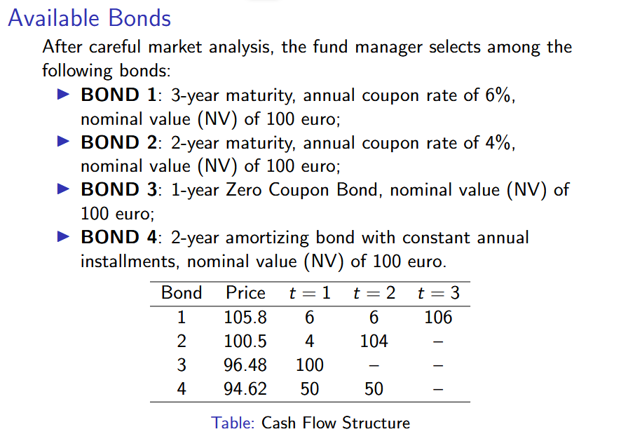
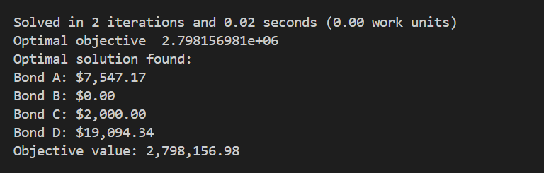

# Pension Fund Portfolio Optimization Model

The optimization model to construct a bond portfolio that generates adequate cash flows while minimizing the initial investment cost.

## Problem

Assuming three future periods, the fund must make specific
payments in each of them and ensure that sufficient bond proceeds
are available at the required dates. The objective is therefore to
construct a bond portfolio that generates adequate cash flows
while minimizing the initial investment cost.

## Solution

